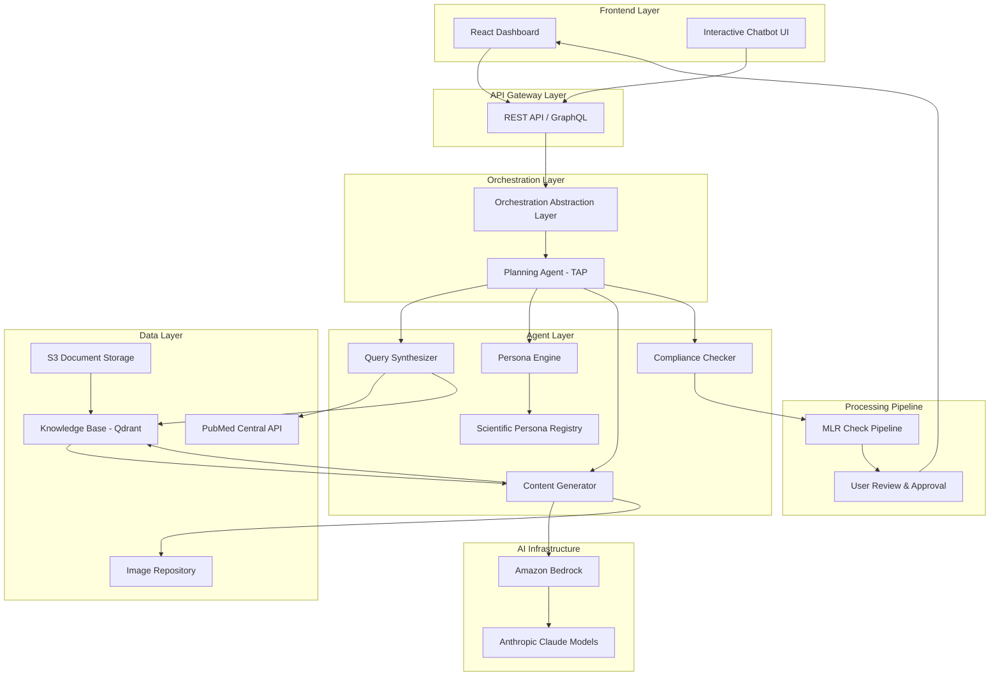
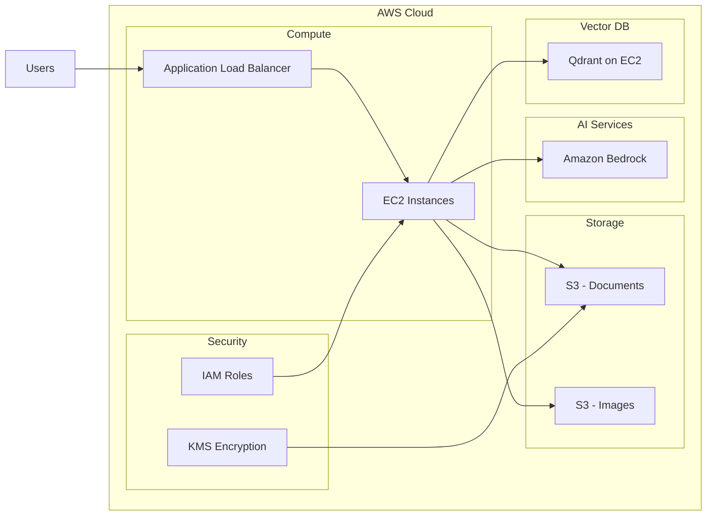

# Design Document: Medical Assistant AI

## Overview

The Medical Assistant AI system is a comprehensive content creation ecosystem built on AWS infrastructure using Python for backend services and React for the frontend interface. The architecture follows a multi-agent orchestration pattern where specialized agents collaborate to transform medical literature into persona-specific, citation-backed content.

The system addresses two critical challenges in medical content creation:
1. **Fragmentation**: Medical literature scattered across thousands of journals
2. **Human Error**: Risk of missing critical details, outdated guidelines, or ineffective source validation

The solution employs three core pillars:
- **Smart Aggregation**: Combines PubMed Central search, user uploads, and real-time trends
- **Hyper-Personalization**: Adapts content for specific medical personas (Oncologist, Pediatrician, General Physician)
- **Compliance First**: Ensures evidence-backed outputs with full citations

### Key Design Principles

1. **Citation Traceability**: Every claim must link to a verifiable source
2. **Persona-Driven Generation**: Single source material generates distinct narratives for different audiences
3. **Closed-Loop Verification**: Only trusted sources (PubMed Central, vetted uploads) inform content
4. **Think-Plan-Act Orchestration**: Planning agent coordinates workflow before execution
5. **Real-Time Relevance**: Integration of trending research and drug approvals

## Architecture

### High-Level Architecture



### Component Architecture

The system follows a layered architecture with clear separation of concerns:

1. **Presentation Layer**: React-based dashboard and chatbot interface
2. **API Layer**: RESTful endpoints for client-server communication
3. **Orchestration Layer**: Planning agent coordinates multi-agent workflows
4. **Agent Layer**: Specialized agents for query synthesis, personalization, generation, and compliance
5. **Data Layer**: Vector database (Qdrant), document storage (S3), and external APIs (PubMed)
6. **AI Infrastructure**: Amazon Bedrock with Anthropic Claude models

### Deployment Architecture



## Components and Interfaces

### 1. Query Synthesizer Agent

**Purpose**: Optimizes user search queries and retrieves relevant medical literature from PubMed Central.

**Responsibilities**:
- Expand clinical keywords with medical terminology
- Apply Boolean operators for precision
- Fetch papers from PubMed Central API
- Rank results by relevance
- Handle query ambiguity

**Interface**:
```python
class QuerySynthesizer:
    def synthesize_query(self, keywords: List[str], filters: SearchFilters) -> OptimizedQuery
    def search_pubmed(self, query: OptimizedQuery) -> List[Article]
    def rank_results(self, articles: List[Article], keywords: List[str]) -> List[RankedArticle]
    def suggest_alternatives(self, query: OptimizedQuery) -> List[str]
```

**Inputs**:
- User-provided clinical keywords
- Search filters (date range, journal type, study type)

**Outputs**:
- Ranked list of relevant articles from PubMed Central
- Alternative keyword suggestions (if no results)

### 2. Persona Engine

**Purpose**: Adapts content tone, depth, and terminology for specific medical audiences.

**Responsibilities**:
- Load persona profiles from Scientific Persona Registry
- Apply persona-specific transformations to content
- Adjust medical terminology complexity
- Modify narrative structure for target audience

**Interface**:
```python
class PersonaEngine:
    def load_persona(self, persona_type: PersonaType) -> MedicalPersona
    def adapt_content(self, content: str, persona: MedicalPersona, 
                     tone: Tone, depth: Depth) -> str
    def validate_persona_alignment(self, content: str, persona: MedicalPersona) -> bool
```

**Inputs**:
- Generated content draft
- Selected medical persona (General Physician, Pediatrician, Oncologist)
- Tone, depth, and format parameters

**Outputs**:
- Persona-adapted content with appropriate terminology and structure

### 3. Content Generator Agent

**Purpose**: Produces structured medical content drafts with citation backing.

**Responsibilities**:
- Generate content from source documents
- Embed citations for every factual claim
- Structure content according to format parameters
- Integrate relevant images from repository
- Coordinate with Persona Engine for adaptation

**Interface**:
```python
class ContentGenerator:
    def generate_draft(self, sources: List[Document], outline: ContentOutline,
                      persona: MedicalPersona, config: GenerationConfig) -> ContentDraft
    def embed_citations(self, content: str, sources: List[Document]) -> AnnotatedContent
    def suggest_images(self, content: str, image_repo: ImageRepository) -> List[Image]
    def apply_template(self, content: AnnotatedContent, template: LayoutTemplate) -> FormattedContent
```

**Inputs**:
- Selected source documents
- Content outline from Planning Agent
- Persona and configuration parameters
- Layout template

**Outputs**:
- Structured content draft with embedded citations
- Suggested images with metadata

### 4. Compliance Checker Agent

**Purpose**: Validates that all claims are evidence-backed and flags potential compliance issues.

**Responsibilities**:
- Verify citation backing for all factual claims
- Identify unsupported statements
- Flag content requiring regulatory review
- Validate source credibility

**Interface**:
```python
class ComplianceChecker:
    def validate_citations(self, content: AnnotatedContent) -> ValidationReport
    def identify_unsupported_claims(self, content: AnnotatedContent) -> List[Claim]
    def flag_regulatory_concerns(self, content: AnnotatedContent) -> List[Concern]
    def verify_source_credibility(self, sources: List[Document]) -> CredibilityReport
```

**Inputs**:
- Annotated content with citations
- Source documents

**Outputs**:
- Validation report with flagged issues
- List of unsupported claims
- Regulatory concerns

### 5. Planning Agent (TAP Methodology)

**Purpose**: Orchestrates the content generation workflow using Think-Plan-Act methodology.

**Responsibilities**:
- Analyze source documents (Think)
- Create content outline and execution plan (Plan)
- Coordinate agent execution (Act)
- Handle conflicts between sources
- Identify coverage gaps

**Interface**:
```python
class PlanningAgent:
    def think(self, sources: List[Document], user_intent: Intent) -> Analysis
    def plan(self, analysis: Analysis) -> ExecutionPlan
    def act(self, plan: ExecutionPlan) -> ContentDraft
    def resolve_conflicts(self, conflicting_sources: List[Document]) -> Resolution
    def identify_gaps(self, sources: List[Document], intent: Intent) -> List[Gap]
```

**Inputs**:
- Selected source documents
- User intent and configuration
- Target persona

**Outputs**:
- Content outline
- Execution plan
- Coordinated agent outputs

### 6. MLR Check Pipeline

**Purpose**: Performs Medical, Legal, and Regulatory compliance checks on generated content.

**Responsibilities**:
- Automated compliance scanning
- Citation sufficiency validation
- Regulatory flag identification
- Generate compliance report

**Interface**:
```python
class MLRPipeline:
    def run_compliance_check(self, content: ContentDraft) -> ComplianceReport
    def validate_citation_sufficiency(self, content: ContentDraft) -> bool
    def identify_regulatory_flags(self, content: ContentDraft) -> List[RegulatoryFlag]
    def generate_report(self, checks: List[Check]) -> ComplianceReport
```

**Inputs**:
- Generated content draft with citations

**Outputs**:
- Compliance report with flagged issues
- Pass/fail status for automated checks

### 7. Knowledge Base (Qdrant Vector Database)

**Purpose**: Stores and retrieves medical literature using semantic search.

**Responsibilities**:
- Index source documents as vector embeddings
- Perform semantic similarity search
- Maintain document metadata
- Sync with PubMed Central
- Store user-uploaded documents

**Interface**:
```python
class KnowledgeBase:
    def index_document(self, document: Document) -> str
    def semantic_search(self, query: str, filters: Dict) -> List[Document]
    def get_document(self, doc_id: str) -> Document
    def sync_pubmed(self) -> SyncReport
    def delete_document(self, doc_id: str) -> bool
```

**Inputs**:
- Documents from PubMed Central or user uploads
- Search queries

**Outputs**:
- Semantically relevant documents
- Document metadata and content

### 8. Image Repository

**Purpose**: Manages medical images and figures with metadata.

**Responsibilities**:
- Store built-in medical images
- Extract figures from uploaded papers
- Maintain image metadata and source links
- Suggest relevant images for content

**Interface**:
```python
class ImageRepository:
    def store_image(self, image: Image, metadata: ImageMetadata) -> str
    def extract_figures(self, document: Document) -> List[Image]
    def search_images(self, keywords: List[str]) -> List[Image]
    def get_image_metadata(self, image_id: str) -> ImageMetadata
```

**Inputs**:
- Medical images (built-in or extracted)
- Search keywords

**Outputs**:
- Images with metadata
- Source document links

### 9. Trend Feed Service

**Purpose**: Aggregates real-time medical trends, drug approvals, and clinical alerts.

**Responsibilities**:
- Pull trending research (24h-7 days)
- Fetch drug approval announcements
- Aggregate clinical alerts
- Update dashboard feed

**Interface**:
```python
class TrendFeedService:
    def fetch_trending_research(self, timeframe: Timeframe) -> List[TrendItem]
    def fetch_drug_approvals(self, timeframe: Timeframe) -> List[DrugApproval]
    def fetch_clinical_alerts(self, timeframe: Timeframe) -> List[Alert]
    def update_feed(self) -> TrendFeed
```

**Inputs**:
- Timeframe specification (24h, 48h, 7 days)

**Outputs**:
- Aggregated trend feed items

### 10. Interactive Chatbot

**Purpose**: Provides conversational interface for content refinement and Q&A.

**Responsibilities**:
- Answer questions about generated content
- Apply real-time edits via conversational commands
- Maintain conversation context
- Reference source documents in responses

**Interface**:
```python
class InteractiveChatbot:
    def process_query(self, query: str, context: ConversationContext) -> Response
    def apply_edit(self, command: EditCommand, content: ContentDraft) -> ContentDraft
    def get_citation_info(self, claim: str, content: ContentDraft) -> Citation
    def maintain_context(self, interaction: Interaction) -> ConversationContext
```

**Inputs**:
- User queries and commands
- Current content draft
- Conversation history

**Outputs**:
- Context-aware responses
- Modified content drafts

## Data Models

### Document

```python
@dataclass
class Document:
    id: str
    title: str
    authors: List[str]
    abstract: str
    full_text: str
    publication_date: datetime
    journal: str
    doi: Optional[str]
    pmid: Optional[str]  # PubMed ID
    source_type: SourceType  # PUBMED, USER_UPLOAD
    metadata: Dict[str, Any]
    embeddings: Optional[List[float]]
    
class SourceType(Enum):
    PUBMED = "pubmed"
    USER_UPLOAD = "user_upload"
```

### MedicalPersona

```python
@dataclass
class MedicalPersona:
    persona_type: PersonaType
    expertise_level: ExpertiseLevel
    terminology_complexity: TerminologyComplexity
    preferred_structure: ContentStructure
    focus_areas: List[str]
    
class PersonaType(Enum):
    GENERAL_PHYSICIAN = "general_physician"
    PEDIATRICIAN = "pediatrician"
    ONCOLOGIST = "oncologist"
    
class ExpertiseLevel(Enum):
    BASIC = "basic"
    INTERMEDIATE = "intermediate"
    ADVANCED = "advanced"
    
class TerminologyComplexity(Enum):
    SIMPLIFIED = "simplified"
    STANDARD = "standard"
    TECHNICAL = "technical"
```

### ContentDraft

```python
@dataclass
class ContentDraft:
    id: str
    project_id: str
    title: str
    content: str
    citations: List[Citation]
    images: List[ImageReference]
    persona: MedicalPersona
    generation_config: GenerationConfig
    created_at: datetime
    updated_at: datetime
    status: DraftStatus
    
class DraftStatus(Enum):
    GENERATING = "generating"
    REVIEW = "review"
    MLR_CHECK = "mlr_check"
    APPROVED = "approved"
    FINALIZED = "finalized"
```

### Citation

```python
@dataclass
class Citation:
    id: str
    document_id: str
    claim_text: str
    source_text: str
    page_number: Optional[int]
    section: Optional[str]
    confidence_score: float
    citation_format: str  # Formatted reference string
```

### Project

```python
@dataclass
class Project:
    id: str
    user_id: str
    name: str
    description: Optional[str]
    selected_sources: List[str]  # Document IDs
    persona: MedicalPersona
    generation_config: GenerationConfig
    drafts: List[str]  # ContentDraft IDs
    created_at: datetime
    updated_at: datetime
    status: ProjectStatus
    
class ProjectStatus(Enum):
    SETUP = "setup"
    SOURCE_SELECTION = "source_selection"
    CONFIGURATION = "configuration"
    GENERATING = "generating"
    REVIEW = "review"
    FINALIZED = "finalized"
```

### GenerationConfig

```python
@dataclass
class GenerationConfig:
    tone: Tone
    depth: Depth
    format: ContentFormat
    purpose: Purpose
    layout_template: LayoutTemplate
    include_images: bool
    max_length: Optional[int]
    
class Tone(Enum):
    FORMAL = "formal"
    CONVERSATIONAL = "conversational"
    EDUCATIONAL = "educational"
    
class Depth(Enum):
    OVERVIEW = "overview"
    DETAILED = "detailed"
    COMPREHENSIVE = "comprehensive"
    
class ContentFormat(Enum):
    ARTICLE = "article"
    SUMMARY = "summary"
    REPORT = "report"
    PRESENTATION = "presentation"
    
class Purpose(Enum):
    EDUCATION = "education"
    RESEARCH_SUMMARY = "research_summary"
    CLINICAL_GUIDELINE = "clinical_guideline"
    PATIENT_COMMUNICATION = "patient_communication"
```

### Image and ImageMetadata

```python
@dataclass
class Image:
    id: str
    filename: str
    s3_url: str
    thumbnail_url: str
    format: ImageFormat
    size_bytes: int
    metadata: ImageMetadata
    
@dataclass
class ImageMetadata:
    title: Optional[str]
    caption: Optional[str]
    source_document_id: Optional[str]
    keywords: List[str]
    medical_category: Optional[str]
    created_at: datetime
    
class ImageFormat(Enum):
    PNG = "png"
    JPEG = "jpeg"
    SVG = "svg"
```

### SearchFilters

```python
@dataclass
class SearchFilters:
    date_range: Optional[DateRange]
    journal_types: List[JournalType]
    study_types: List[StudyType]
    languages: List[str]
    
@dataclass
class DateRange:
    start_date: datetime
    end_date: datetime
    
class JournalType(Enum):
    PEER_REVIEWED = "peer_reviewed"
    CLINICAL_TRIAL = "clinical_trial"
    REVIEW = "review"
    META_ANALYSIS = "meta_analysis"
    
class StudyType(Enum):
    RANDOMIZED_CONTROLLED = "randomized_controlled"
    OBSERVATIONAL = "observational"
    CASE_STUDY = "case_study"
    SYSTEMATIC_REVIEW = "systematic_review"
```

### TrendItem

```python
@dataclass
class TrendItem:
    id: str
    title: str
    summary: str
    source: str
    url: str
    published_at: datetime
    trend_type: TrendType
    relevance_score: float
    
class TrendType(Enum):
    RESEARCH = "research"
    DRUG_APPROVAL = "drug_approval"
    CLINICAL_ALERT = "clinical_alert"
    GUIDELINE_UPDATE = "guideline_update"
```

### ComplianceReport

```python
@dataclass
class ComplianceReport:
    draft_id: str
    timestamp: datetime
    overall_status: ComplianceStatus
    citation_coverage: float  # Percentage of claims with citations
    unsupported_claims: List[UnsupportedClaim]
    regulatory_flags: List[RegulatoryFlag]
    recommendations: List[str]
    
@dataclass
class UnsupportedClaim:
    claim_text: str
    location: TextLocation
    severity: Severity
    
@dataclass
class RegulatoryFlag:
    content_snippet: str
    location: TextLocation
    flag_type: FlagType
    description: str
    
class ComplianceStatus(Enum):
    PASSED = "passed"
    WARNINGS = "warnings"
    FAILED = "failed"
    
class Severity(Enum):
    LOW = "low"
    MEDIUM = "medium"
    HIGH = "high"
    
class FlagType(Enum):
    UNVERIFIED_CLAIM = "unverified_claim"
    OUTDATED_GUIDELINE = "outdated_guideline"
    MISSING_DISCLAIMER = "missing_disclaimer"
    REGULATORY_REVIEW_REQUIRED = "regulatory_review_required"
```


## Correctness Properties

A property is a characteristic or behavior that should hold true across all valid executions of a system—essentially, a formal statement about what the system should do. Properties serve as the bridge between human-readable specifications and machine-verifiable correctness guarantees.

### Property Reflection

After analyzing all acceptance criteria, several redundancies were identified:

- **Citation properties (4.1 and 4.4)**: Both require all claims to be citation-backed. Property 4 consolidates these.
- **Document upload and integration (1.2 and 10.3)**: Both test that selected documents are added to the knowledge base. Property 2 covers this comprehensively.
- **Export format properties (11.1, 11.2, 11.3)**: Combined into Property 24 testing all export formats.
- **Trend feed display (6.2, 6.3)**: Combined into Property 13 testing all trend types.
- **Metadata completeness (4.2 and 12.4)**: Both require complete document metadata. Property 5 consolidates these.

### Core Properties

**Property 1: Query-to-Results Mapping**
*For any* set of clinical keywords provided by a user, the Query_Synthesizer should return papers from PubMed_Central, and the results should be ranked in descending order by relevance score.
**Validates: Requirements 1.1, 1.5**

**Property 2: Document Upload Integration**
*For any* document uploaded by a user (in PDF, DOCX, or TXT format), the document should be indexed in the Knowledge_Base and retrievable via search.
**Validates: Requirements 1.2, 1.4, 10.3**

**Property 3: Source Traceability**
*For any* content generated from source documents, every piece of information should maintain a traceable link back to its original Source_Document.
**Validates: Requirements 1.3**

**Property 4: Citation Completeness**
*For any* Content_Draft generated by the system, every factual claim should be linked to at least one Citation with complete reference information (source, authors, publication date, DOI/URL).
**Validates: Requirements 4.1, 4.2, 4.4**

**Property 5: Citation Verification Round-Trip**
*For any* Citation in a Content_Draft, requesting source verification should return the original text chunk from the Source_Document that supports the claim.
**Validates: Requirements 4.3**

**Property 6: Unsupported Claim Detection**
*For any* Content_Draft, if the Compliance_Checker identifies claims without citation backing, those claims should be flagged in the compliance report.
**Validates: Requirements 4.5, 9.2**

**Property 7: Persona Adaptation Distinctness**
*For any* source document and any two different Medical_Personas, the generated content should be distinct, with measurable differences in terminology complexity and structure appropriate to each persona.
**Validates: Requirements 2.1, 2.3**

**Property 8: Configuration Parameter Application**
*For any* Content_Draft generated with specified tone, depth, format, and purpose parameters, the output should reflect those parameters in measurable ways (e.g., formal tone uses passive voice, detailed depth includes technical terminology).
**Validates: Requirements 2.4, 2.5, 2.6**

**Property 9: Chatbot Context Preservation**
*For any* conversation session, information provided in earlier interactions should be available and referenceable in later interactions within the same session.
**Validates: Requirements 3.4**

**Property 10: Conversational Edit Application**
*For any* edit command issued via the chatbot, the Content_Draft should be modified to reflect the requested change, and the modification should be verifiable in the updated content.
**Validates: Requirements 3.2**

**Property 11: Claim-to-Citation Query**
*For any* factual claim in a Content_Draft, asking the chatbot about that claim should return the corresponding Citation information.
**Validates: Requirements 3.5**

**Property 12: Image Extraction and Metadata**
*For any* Source_Document containing figures or charts, the extracted images should be cataloged in the Image_Repository with metadata linking them to the original source document.
**Validates: Requirements 5.2, 5.4**

**Property 13: Trend Feed Recency**
*For any* item in the Trend_Feed, the publication date should be within the specified timeframe (24 hours to 7 days from current time).
**Validates: Requirements 6.1**

**Property 14: Trend Item Incorporation**
*For any* trend item selected by a user, the system should allow it to be added to the source set for content generation.
**Validates: Requirements 6.5**

**Property 15: Content Generation Completeness**
*For any* valid configuration (selected sources, persona, tone, depth, format), the Content_Generator should produce a structured Content_Draft with all required sections.
**Validates: Requirements 7.4**

**Property 16: Export Format Preservation**
*For any* finalized content exported in a user's preferred format, the exported file should contain all content, citations, and images from the Content_Draft.
**Validates: Requirements 7.8, 11.4, 11.5**

**Property 17: Planning Agent Outline Creation**
*For any* content generation request, the Planning_Agent should create a content outline before the Content_Generator produces the full draft.
**Validates: Requirements 8.2**

**Property 18: Gap Notification**
*For any* source coverage gap identified by the Planning_Agent, a notification should be sent to the user describing the gap.
**Validates: Requirements 8.3**

**Property 19: Source Conflict Resolution**
*For any* set of conflicting sources, the Planning_Agent should prioritize sources based on recency and authority, with more recent or authoritative sources taking precedence.
**Validates: Requirements 8.5**

**Property 20: MLR Compliance Execution**
*For any* Content_Draft, the MLR_Pipeline should execute automated compliance checks and produce a ComplianceReport identifying any issues.
**Validates: Requirements 9.1, 9.3, 9.4**

**Property 21: Search Result Metadata Completeness**
*For any* search results returned from PubMed_Central, each result should include title, abstract, publication date, and relevance score.
**Validates: Requirements 10.1**

**Property 22: Source Selection Reflection**
*For any* project, the displayed count of selected sources should equal the actual number of Source_Documents in the project's active Knowledge_Base.
**Validates: Requirements 10.4**

**Property 23: Project Persistence Round-Trip**
*For any* project saved by a user, loading the project should restore all configuration, selected sources, and generated content exactly as they were when saved.
**Validates: Requirements 13.6**

**Property 24: Multi-Format Export Support**
*For any* finalized content, the system should successfully export it in PDF, DOCX, and HTML formats, with each export containing all content and citations.
**Validates: Requirements 11.1, 11.2, 11.3**

**Property 25: Query Expansion**
*For any* set of clinical keywords, the Query_Synthesizer should produce an expanded query that includes additional relevant medical terminology beyond the original keywords.
**Validates: Requirements 14.1**

**Property 26: Boolean Operator Application**
*For any* optimized query produced by the Query_Synthesizer, the query should contain Boolean operators (AND, OR, NOT) to improve search precision.
**Validates: Requirements 14.2**

**Property 27: Zero-Result Alternative Suggestions**
*For any* search query that returns zero results, the Query_Synthesizer should suggest at least one alternative keyword or query formulation.
**Validates: Requirements 14.5**

**Property 28: Error Message Descriptiveness**
*For any* error that occurs during content generation, the error message displayed to the user should include a description of what went wrong and, where applicable, suggested remediation steps.
**Validates: Requirements 16.1**

**Property 29: Graceful Degradation on Document Processing Failure**
*For any* batch of Source_Documents where one or more cannot be processed, the system should notify the user of the failures and successfully process the remaining documents.
**Validates: Requirements 16.2**

**Property 30: Document Encryption at Rest**
*For any* document uploaded by a user, the stored version in S3 should be encrypted using AES-256 encryption.
**Validates: Requirements 17.1**

**Property 31: User Data Isolation**
*For any* user, attempting to access another user's projects or documents should be denied, ensuring complete data isolation between users.
**Validates: Requirements 17.3**

**Property 32: Audit Log Completeness**
*For any* access to a user's documents, an audit log entry should be created with timestamp, user ID, document ID, and action type.
**Validates: Requirements 17.4**

**Property 33: Knowledge Base Synchronization**
*For any* recent publication (within the last 24 hours) in PubMed_Central, after synchronization, searching for that publication by title or keywords should return it in the results.
**Validates: Requirements 12.3**

**Property 34: User Project Retrieval**
*For any* authenticated user, logging in should display all projects owned by that user and no projects owned by other users.
**Validates: Requirements 13.2**

**Property 35: Project Lifecycle Operations**
*For any* user, the system should support creating a new project, opening an existing project, and deleting a project, with each operation completing successfully and reflecting the change in the user's project list.
**Validates: Requirements 13.3, 13.4, 13.5**

**Property 36: Chatbot Source Grounding**
*For any* question asked about the Content_Draft, the chatbot's answer should be verifiable as grounded in either the generated content or the Source_Documents.
**Validates: Requirements 3.1, 3.3**

**Property 37: Image Relevance Suggestion**
*For any* content generated on a specific medical topic, the suggested images from the Image_Repository should be relevant to that topic, as measured by keyword overlap or semantic similarity.
**Validates: Requirements 5.3**

**Property 38: Template-Based Image Positioning**
*For any* layout template selected and any set of images, the images should be positioned in the Content_Draft according to the template's positioning rules.
**Validates: Requirements 5.6**

**Property 39: Ambiguous Term Clarification**
*For any* clinical keyword identified as ambiguous by the Query_Synthesizer, the system should request clarification from the user before proceeding with the search.
**Validates: Requirements 14.3**

## Error Handling

### Error Categories

The Medical Assistant AI system handles errors across multiple categories:

1. **External Service Failures**: PubMed Central API unavailability, AWS service disruptions
2. **Document Processing Errors**: Corrupted files, unsupported formats, extraction failures
3. **Content Generation Errors**: Model failures, timeout errors, insufficient source material
4. **Compliance Failures**: Unsupported claims, missing citations, regulatory flags
5. **User Input Errors**: Invalid configurations, empty source selections, malformed queries
6. **Security Errors**: Authentication failures, authorization violations, encryption errors

### Error Handling Strategies

#### 1. Graceful Degradation

When external services fail, the system continues operating with reduced functionality:

```python
def fetch_from_pubmed(query: OptimizedQuery) -> List[Article]:
    try:
        articles = pubmed_api.search(query)
        return articles
    except PubMedUnavailableError:
        logger.error("PubMed Central unavailable")
        notify_user("PubMed Central is currently unavailable. Please use document upload.")
        return []  # Return empty list, allow user to proceed with uploads
```

#### 2. Partial Success Handling

When processing multiple documents, failures on individual items don't block the entire operation:

```python
def process_documents(documents: List[Document]) -> ProcessingResult:
    successful = []
    failed = []
    
    for doc in documents:
        try:
            processed = process_single_document(doc)
            successful.append(processed)
        except ProcessingError as e:
            logger.error(f"Failed to process {doc.id}: {e}")
            failed.append((doc, str(e)))
    
    if failed:
        notify_user(f"Failed to process {len(failed)} documents. Continuing with {len(successful)}.")
    
    return ProcessingResult(successful=successful, failed=failed)
```

#### 3. Retry with Exponential Backoff

Transient failures are retried automatically:

```python
@retry(max_attempts=3, backoff=exponential_backoff)
def sync_knowledge_base():
    try:
        new_publications = fetch_recent_publications()
        index_publications(new_publications)
    except TransientError as e:
        logger.warning(f"Sync failed, will retry: {e}")
        raise  # Trigger retry
```

#### 4. Validation Before Processing

Input validation prevents errors before expensive operations:

```python
def validate_generation_config(config: GenerationConfig) -> ValidationResult:
    errors = []
    
    if not config.selected_sources:
        errors.append("At least one source document must be selected")
    
    if not config.persona:
        errors.append("Target persona must be specified")
    
    if config.max_length and config.max_length < 100:
        errors.append("Maximum length must be at least 100 words")
    
    return ValidationResult(valid=len(errors) == 0, errors=errors)
```

#### 5. Compliance Failure Handling

Compliance failures don't block content generation but require user acknowledgment:

```python
def handle_compliance_failure(draft: ContentDraft, report: ComplianceReport):
    if report.overall_status == ComplianceStatus.FAILED:
        # Present draft with warnings, don't block
        present_draft_with_warnings(draft, report)
        require_user_acknowledgment(
            "This content has compliance issues. Review flagged items before finalizing."
        )
    elif report.overall_status == ComplianceStatus.WARNINGS:
        present_draft_with_warnings(draft, report)
```

#### 6. Security Error Handling

Security violations are logged and result in immediate denial:

```python
def access_document(user_id: str, document_id: str) -> Document:
    document = get_document(document_id)
    
    if document.owner_id != user_id:
        audit_log.log_violation(
            user_id=user_id,
            action="unauthorized_access_attempt",
            resource=document_id
        )
        raise UnauthorizedError("Access denied")
    
    audit_log.log_access(user_id=user_id, document_id=document_id)
    return document
```

### Error Response Format

All errors returned to the frontend follow a consistent format:

```python
@dataclass
class ErrorResponse:
    error_code: str
    message: str
    details: Optional[Dict[str, Any]]
    suggested_actions: List[str]
    timestamp: datetime
    request_id: str
```

Example error responses:

```python
# Document processing error
ErrorResponse(
    error_code="DOC_PROCESSING_FAILED",
    message="Unable to process document 'research_paper.pdf'",
    details={"document_id": "doc_123", "reason": "Corrupted PDF structure"},
    suggested_actions=["Try re-uploading the document", "Convert to a different format"],
    timestamp=datetime.now(),
    request_id="req_abc123"
)

# Compliance error
ErrorResponse(
    error_code="COMPLIANCE_WARNINGS",
    message="Content has 3 unsupported claims",
    details={"unsupported_claims": [...], "citation_coverage": 0.85},
    suggested_actions=["Review flagged claims", "Add supporting citations", "Proceed with acknowledgment"],
    timestamp=datetime.now(),
    request_id="req_def456"
)
```

## Testing Strategy

### Dual Testing Approach

The Medical Assistant AI system employs both unit testing and property-based testing to ensure comprehensive coverage:

- **Unit Tests**: Verify specific examples, edge cases, error conditions, and integration points
- **Property Tests**: Verify universal properties across all inputs through randomization

This dual approach is complementary and necessary:
- Unit tests catch concrete bugs in specific scenarios
- Property tests verify general correctness across the input space

### Property-Based Testing Configuration

**Library Selection**: 
- Python: `hypothesis` library for property-based testing
- Minimum 100 iterations per property test (due to randomization)

**Test Tagging**:
Each property test must reference its design document property using the format:
```python
# Feature: medical-assistant-ai, Property 1: Query-to-Results Mapping
@given(clinical_keywords=st.lists(st.text(min_size=1), min_size=1))
def test_query_to_results_mapping(clinical_keywords):
    # Test implementation
```

**Property Test Implementation**:
Each correctness property from the design document must be implemented as a single property-based test. The test should:
1. Generate random valid inputs using hypothesis strategies
2. Execute the system behavior
3. Assert the property holds for the generated inputs
4. Run for at least 100 iterations

### Unit Testing Strategy

Unit tests focus on:

1. **Specific Examples**: Concrete scenarios that demonstrate correct behavior
   - Example: Test that searching for "diabetes treatment" returns relevant papers
   - Example: Test that uploading a valid PDF succeeds

2. **Edge Cases**: Boundary conditions and special cases
   - Empty input handling
   - Maximum size documents (50MB)
   - Zero search results
   - Single source document generation

3. **Error Conditions**: Specific error scenarios
   - Corrupted document upload
   - PubMed API unavailability
   - Invalid authentication tokens
   - Malformed configuration

4. **Integration Points**: Component interactions
   - Planning Agent coordinating with Content Generator
   - Compliance Checker validating Content Generator output
   - Knowledge Base integration with Query Synthesizer

### Test Organization

```
tests/
├── unit/
│   ├── test_query_synthesizer.py
│   ├── test_persona_engine.py
│   ├── test_content_generator.py
│   ├── test_compliance_checker.py
│   ├── test_planning_agent.py
│   ├── test_mlr_pipeline.py
│   ├── test_knowledge_base.py
│   ├── test_image_repository.py
│   ├── test_trend_feed.py
│   └── test_chatbot.py
├── property/
│   ├── test_properties_aggregation.py      # Properties 1-3
│   ├── test_properties_citations.py        # Properties 4-6
│   ├── test_properties_personalization.py  # Properties 7-8
│   ├── test_properties_chatbot.py          # Properties 9-11
│   ├── test_properties_images.py           # Properties 12, 37-38
│   ├── test_properties_trends.py           # Properties 13-14
│   ├── test_properties_generation.py       # Properties 15-16
│   ├── test_properties_planning.py         # Properties 17-19
│   ├── test_properties_compliance.py       # Properties 20
│   ├── test_properties_search.py           # Properties 21-22, 25-27, 39
│   ├── test_properties_projects.py         # Properties 23, 34-35
│   ├── test_properties_export.py           # Properties 24
│   ├── test_properties_errors.py           # Properties 28-29
│   └── test_properties_security.py         # Properties 30-32
├── integration/
│   ├── test_end_to_end_workflow.py
│   ├── test_pubmed_integration.py
│   ├── test_bedrock_integration.py
│   └── test_qdrant_integration.py
└── fixtures/
    ├── sample_documents.py
    ├── sample_personas.py
    └── sample_configurations.py
```

### Example Property Test

```python
# Feature: medical-assistant-ai, Property 4: Citation Completeness
from hypothesis import given, strategies as st
import hypothesis.strategies as st

@given(
    sources=st.lists(
        st.builds(Document, 
                  title=st.text(min_size=10),
                  content=st.text(min_size=100)),
        min_size=1,
        max_size=10
    ),
    persona=st.sampled_from([PersonaType.GENERAL_PHYSICIAN, 
                             PersonaType.PEDIATRICIAN, 
                             PersonaType.ONCOLOGIST])
)
def test_citation_completeness(sources, persona):
    """
    Property 4: For any Content_Draft generated by the system, 
    every factual claim should be linked to at least one Citation 
    with complete reference information.
    """
    # Generate content
    config = GenerationConfig(persona=persona, tone=Tone.FORMAL)
    draft = content_generator.generate_draft(sources, config)
    
    # Extract factual claims
    claims = extract_factual_claims(draft.content)
    
    # Verify each claim has at least one citation
    for claim in claims:
        citations = get_citations_for_claim(claim, draft.citations)
        assert len(citations) >= 1, f"Claim '{claim}' has no citations"
        
        # Verify citation completeness
        for citation in citations:
            assert citation.document_id is not None
            assert citation.source_text is not None
            assert citation.citation_format is not None
            # Verify the citation has complete reference info
            doc = get_document(citation.document_id)
            assert doc.authors is not None and len(doc.authors) > 0
            assert doc.publication_date is not None
            assert doc.doi is not None or doc.pmid is not None
```

### Example Unit Test

```python
def test_pubmed_unavailable_graceful_degradation():
    """
    Test that when PubMed is unavailable, the system notifies 
    the user and allows proceeding with document uploads.
    """
    # Mock PubMed API to raise unavailable error
    with mock.patch('pubmed_api.search', side_effect=PubMedUnavailableError()):
        query = OptimizedQuery(keywords=["diabetes", "treatment"])
        
        # Should return empty list, not raise exception
        results = query_synthesizer.search_pubmed(query)
        assert results == []
        
        # Should notify user
        assert "PubMed Central is currently unavailable" in get_last_notification()
        assert "use document upload" in get_last_notification().lower()

def test_zero_sources_prevents_generation():
    """
    Test that attempting to generate content with no sources 
    is prevented with appropriate error message.
    """
    config = GenerationConfig(
        selected_sources=[],  # Empty sources
        persona=PersonaType.GENERAL_PHYSICIAN
    )
    
    validation = validate_generation_config(config)
    assert not validation.valid
    assert "at least one source document must be selected" in validation.errors[0].lower()
```

### Integration Testing

Integration tests verify end-to-end workflows and external service interactions:

1. **End-to-End Workflow Test**: Complete user journey from search to export
2. **PubMed Integration Test**: Real API calls to PubMed Central (with rate limiting)
3. **Bedrock Integration Test**: Real calls to Amazon Bedrock with Anthropic models
4. **Qdrant Integration Test**: Vector database operations with real embeddings

### Test Data Management

**Fixtures**:
- Sample medical documents with known content
- Pre-defined personas with expected characteristics
- Standard configurations for reproducible tests

**Mocking Strategy**:
- Mock external APIs (PubMed, Bedrock) in unit tests
- Use real services in integration tests with test accounts
- Mock S3 operations in unit tests, use test buckets in integration tests

### Continuous Testing

- All tests run on every commit via CI/CD pipeline
- Property tests run with 100 iterations in CI, 1000 iterations nightly
- Integration tests run on merge to main branch
- Performance benchmarks run weekly

### Coverage Goals

- Unit test coverage: >85% of code
- Property test coverage: 100% of correctness properties
- Integration test coverage: All major user workflows
- Edge case coverage: All identified edge cases from requirements
