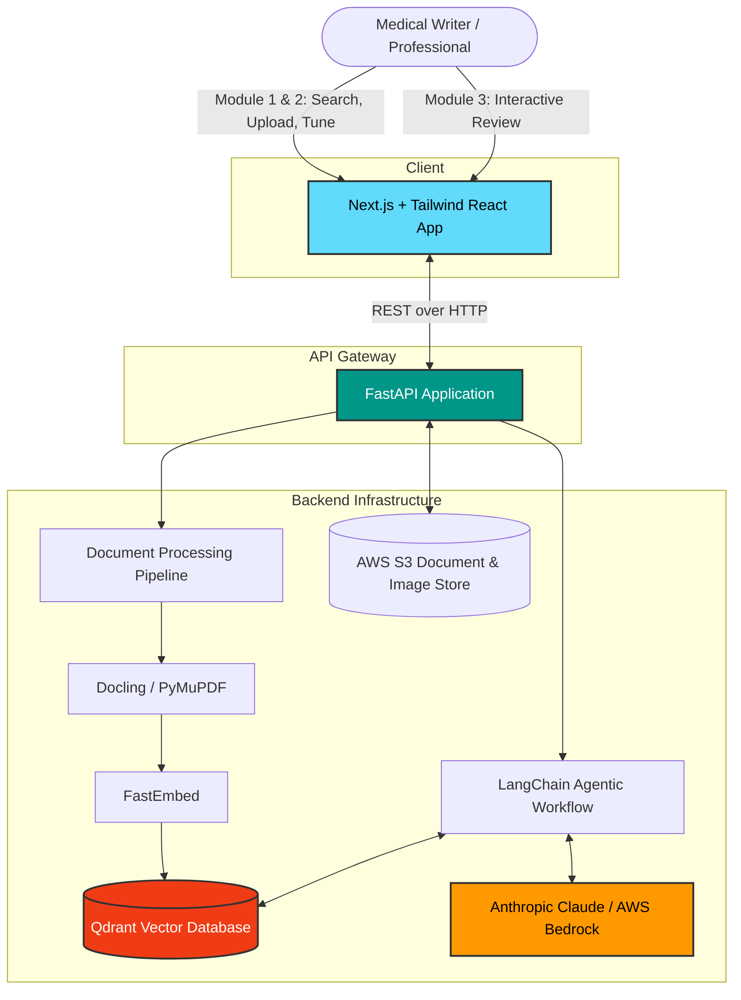

# Medical Assistant AI

> An AI-powered content creation ecosystem for medical writers to generate accurate, high-quality, and compliant medical summaries and articles.

**Powered by AWS** | **Innovation Partner: H2S** | **Media Partner: YOURSTORY**

## Overall System Architecture

The Medical Assistant platform is a full-stack AI ecosystem designed to accelerate and verify medical content creation through Retrieval-Augmented Generation (RAG) and multi-agent workflows.



## Overview

Medical Assistant AI transforms fragmented medical literature into personalized, compliant content—solving the content creation crisis for medical writers through AI-powered workflow automation. The system reduces content creation time by 90% (hours → minutes) while ensuring enhanced accuracy through citation-backed, verified sources.

## The Problem We Solve

### 1. Fragmentation
Medical literature is scattered across thousands of journals, making manual research highly time-consuming and inefficient.

### 2. Human Error
Manual drafting risks missing critical details, using outdated guidelines, and failing to validate sources effectively.

## Our Solution

### Smart Aggregation
Combines search results from trusted repositories (PubMed Central), user-uploaded documents, and real-time industry trends into one unified dashboard.

### Hyper-Personalization
An engine that rewrites content based on specific medical personas (e.g., Oncologist vs. Pediatrician) to ensure tone and depth match the intended audience.

### Compliance First
Prioritizes evidence-backed outputs with full citations to minimize hallucinations and ensure accuracy.

## Key Features

### 1. Multi-Source Content Input
- **Unified Research**: Fetches papers from trusted repositories via clinical keyword search
- **Internal Data Integration**: Upload proprietary research & internal documents as source material

### 2. Hyper-Personalization Engine
- **Persona-Based Output**: Re-engineers content for specific audiences
- **Customizable Parameters**: Controls Tone, Format, and Purpose

### 3. Interactive Medical Assistant Chatbot
- **Context-Aware Q&A**: Ask questions directly about generated content or sources
- **Real-Time Refinement**: Use conversational commands for instant editing

### 4. Compliance & Risk Mitigation
- **Citation-Backed Outputs**: Every claim linked to a reference, minimizing hallucinations
- **Automated MLR Validation**: Medical, Legal, and Regulatory compliance checking

### 5. Visual Integration Suite
- **Smart Library**: Access built-in medical images or auto-extract figures/charts from uploaded papers

## User Journey

#### 1. Discovery & Input (The Dashboard)
View real-time medical updates and search PubMed Central or upload private documents.

#### 2. Curation & Configuration (The Setup)
Configure target audience, tone, and depth, while selecting visual templates.

#### 3. Generation & Interactive Refinement (The Core)
AI generates structured draft using TAP methodology (Think → Plan → Act) with visible citations. Use the chatbot to tweak responses.

#### 4. Finalization (The Output)
Preview, review MLR compliance, and export to PDF, DOCX, or HTML.

## Getting Started

### Prerequisites
- Python 3.9+
- Node.js 18+
- AWS Account with Bedrock access
- Qdrant instance

### Installation
```bash
# Clone the repository
git clone https://github.com/yourusername/medical-assist.git
cd medical-assist

# Install backend dependencies
cd backend/src
pip install -r main_requirements.txt

# Install frontend dependencies
cd ../../frontend
npm install
```

### Running the Application

```bash
# Start backend server
cd backend/src
uvicorn main:app --reload

# Start frontend (in separate terminal)
cd frontend
npm run dev
```

For more detailed information on specific domains, please refer to the `README.md` files located in the `frontend` and `backend` directories.

## Security & Compliance
- **Encryption**: AES-256 for resting data, TLS 1.3 for transit.
- **HIPAA Compliance**: Designed to meet strict healthcare regulations.

## License
This project is licensed under the MIT License - see the [LICENSE](LICENSE) file for details.

---

*Made by Kiro*
