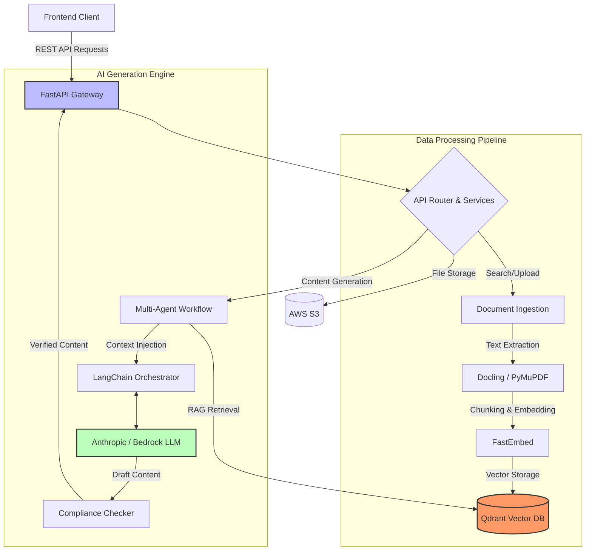

# Medical Assist AI - Backend Services

The backend of the Medical Assist AI platform is a robust, high-performance API supporting a sophisticated multi-agent orchestrated AI system. It handles complex document parsing, vector embeddings, and seamless integration with Large Language Models to generate hyper-personalized medical content.

## System Architecture



## Features and Capabilities

* **Intelligent Document Parsing:** Utilizes tools like `docling`, `PyMuPDF`, and `easyocr` to pull structured data from dense medical PDFs.
* **Vector Search Engine:** Embeds document chunks using `fastembed` and stores them in `Qdrant` for highly accurate Semantic Search.
* **Multi-Agent Orchestration:** Powered by `LangChain`, coordinating task-specific agents (Planner, Medical Writer, Compliance Evaluator).
* **High Concurrency API:** Built on `FastAPI` and `uvicorn` for high-throughput, asynchronous API operations.
* **Cloud Native Storage:** Native integration with AWS infrastructure via `boto3`.

## Core Modules

* `api/`: Endpoint definitions and routing logic for the API.
* `services/`: Core logic encapsulating LLM inference, document parsing, and database operations.
* `models/` & `schema/`: Pydantic data validation and payload typing.
* `utils/`: Helper scripts for document chunking, prompt management, and configuration loading.

## Installation

### Prerequisites
* Python 3.9+ 
* Qdrant instance
* AWS Credentials configured natively

### Setup

```bash
# Create a virtual environment
python -m venv venv
source venv/bin/activate

# Install dependencies
pip install -r src/main_requirements.txt
```

## Running the Service

Launch the development server:

```bash
cd src
uvicorn main:app --reload --port 8000
```

### API Documentation

Once running, access the interactive API documentation:
- **Swagger UI:** `http://localhost:8000/docs`
- **ReDoc:** `http://localhost:8000/redoc`

---

*Made by Kiro*