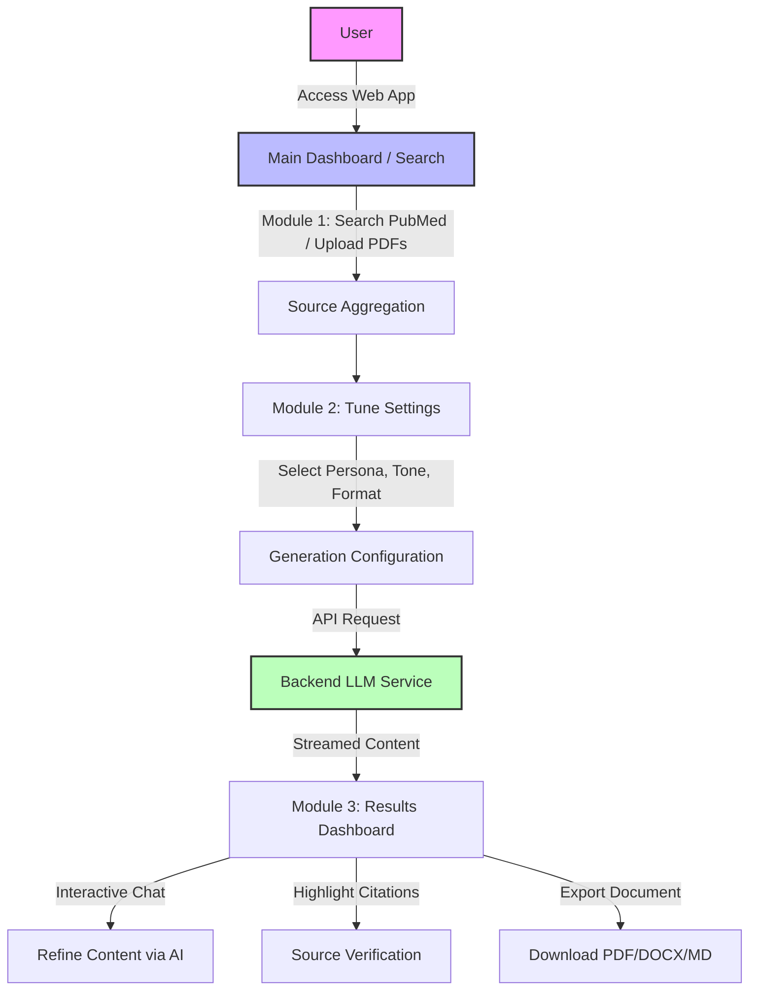

# Clinico-Canvas Frontend

Clinico-Canvas is an AI-driven platform designed to help medical writers efficiently create accurate, personalized, and evidence-backed medical articles. The frontend acts as the user interface orchestrating a seamless 3-step workflow to go from raw medical literature to a polished, compliant article.

## Application Architecture Flow



## Overview

Medical writing is often fragmented and time-consuming, requiring writers to manually filter through thousands of journals. **Clinico-Canvas Frontend** solves this by integrating real-time research, document parsing, and hyper-personalized AI generation into a single intuitive Next.js web application.

### Key Capabilities
* **Reduce Research Burden:** Streamlined UI to search and validate medical sources.
* **Hyper-Personalization:** Interactive forms to tailor content for specific medical personas.
* **Evidence-Backed:** Innovative citation tracking UI that maps AI claims directly back to the uploaded PDFs.

---

## The 3-Module Workflow

The frontend application follows a distinct 3-Module workflow (`/search`, `/tune`, `/result`):

### Module 1: Gather & Select Sources (`/search`)
* **Smart Search:** Query trusted repositories directly from the interface.
* **Document Upload:** Drag-and-drop internal research papers (PDFs) or notes.
* **Trend Analysis:** View trending medical research.

### Module 2: Define Content Requirements (`/tune`)
* **Audience Targeting:** Customize content depth and tone for specific readers (e.g., Oncologist, Pediatrician, General Physician).
* **Parameter Control:** Set tone (Scientific, Empathetic), format (Short Summary, Slide Copy), and region settings.

### Module 3: Generate & Refine (`/result`)
* **Interactive Draft:** View the AI-generated structured draft based on selected sources.
* **Embedded AI Chatbot:** Tweak tone or expand sections dynamically.
* **Citation Management:** Clickable inline citations linked to source PDFs.
* **Visuals & Export:** Integrated image layout and one-click export to PDF, DOCX, or Markdown.

---

## Tech Stack

* **Framework:** Next.js 16 (React 19)
* **Styling:** Tailwind CSS (v4)
* **Typography & Icons:** Inter font family, Lucide-React
* **Markdown Rendering:** React Markdown with GFM support
* **Exporting Utilities:** HTML2Canvas, jsPDF, html-docx-js

---

## Getting Started

1.  **Install dependencies:**
    ```bash
    npm install
    # or
    npm ci
    ```

2.  **Set up Environment Variables:**
    Create a `.local.env` file and add your Backend API URLs.

3.  **Run the development server:**
    ```bash
    npm run dev
    ```

4.  Open [http://localhost:3000](http://localhost:3000) with your browser.

---

## License

Distributed under the MIT License. See `LICENSE` for more information.

---

*Made by Kiro*